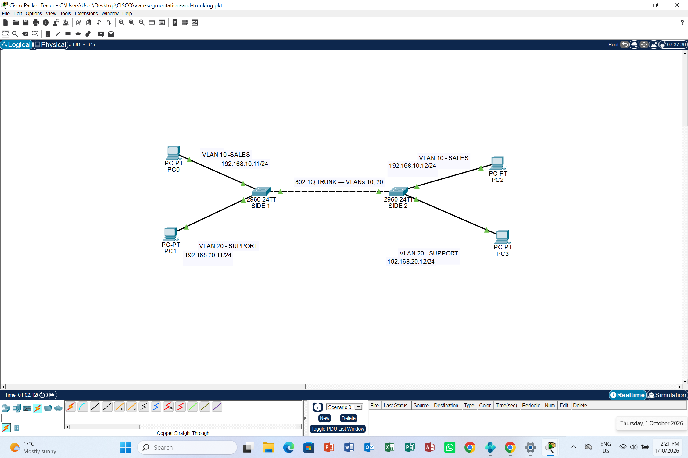

# VLAN Segmentation and Trunking

Cisco Packet Tracer lab demonstrating network segmentation for Sales and Support using VLANs and an 802.1Q trunk between two Cisco 2960 switches.

## Topology

- Two Cisco 2960-24TT switches: SIDE1 and SIDE2
- Four PCs, with one Sales and one Support PC connected to each switch
- An 802.1Q trunk connecting GigabitEthernet0/1 on both switches

## IP Addressing

| Device | IP Address | Subnet Mask | VLAN | Department |
|--------|------------|-------------|------|------------|
| PC0 | 192.168.10.11 | 255.255.255.0 | 10 | Sales |
| PC1 | 192.168.20.11 | 255.255.255.0 | 20 | Support |
| PC2 | 192.168.10.12 | 255.255.255.0 | 10 | Sales |
| PC3 | 192.168.20.12 | 255.255.255.0 | 20 | Support |

## Switch Port Assignments

| Switch | Interface | Role |
|--------|-----------|------|
| SIDE1 | FastEthernet0/1 | Access — VLAN 10 |
| SIDE1 | FastEthernet0/3 | Access — VLAN 20 |
| SIDE2 | FastEthernet0/2 | Access — VLAN 10 |
| SIDE2 | FastEthernet0/3 | Access — VLAN 20 |
| Both | GigabitEthernet0/1 | Trunk |

## Verification

Used `show vlan brief` to verify VLAN membership and
`show interfaces trunk` to verify trunk operation.

Ping testing confirmed connectivity between PCs in the same VLAN
across the trunk. Communication between VLAN 10 and VLAN 20 failed
as expected because inter-VLAN routing was not configured.

## Skills Demonstrated

- VLAN creation and access port assignment
- 802.1Q trunking
- IPv4 addressing and subnetting
- Cisco IOS configuration and verification
- Connectivity testing and network documentation

## Lab File

Download [vlan-segmentation-and-trunking.pkt](vlan-segmentation-and-trunking.pkt)
and open it in Cisco Packet Tracer.
